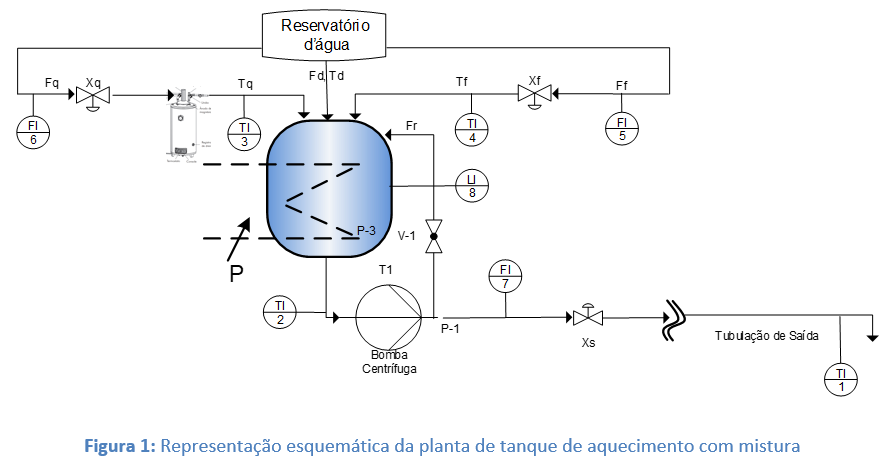

# Chuveiro Turbinado: Controle Avançado de Processos Térmicos

Este repositório apresenta o desenvolvimento de estratégias de controle para um sistema de mistura térmica industrial com elevado atraso de transporte, conhecido como **Chuveiro Turbinado**. O projeto abrange desde a modelagem física inicial até a implementação de arquiteturas de controle em cascata, validadas por métricas quantitativas de erro.

---

## 1. Descrição do Processo
O sistema simula um processo térmico composto por:
* **Boiler (Fonte Térmica):** Sistema de aquecimento governado por controle On-Off.
* **Tanque de Mistura:** Onde ocorre o balanço de massa e energia entre as correntes quente e fria.
* **Tubulação de 50 metros:** Introduz um **Atraso de Transporte (Tempo Morto)** significativo, desafiando a estabilidade dos controladores convencionais.

---

## 2. Roteiro de Desenvolvimento (Passos do Projeto)

Para o cumprimento das exigências acadêmicas e profissionais, o projeto foi estruturado nos seguintes passos:

### Passo 1: Modelagem e Configuração do Ambiente
* Implementação das Equações Diferenciais Ordinárias (EDOs) do sistema.
* Configuração do ambiente de simulação em Python (NumPy, SciPy, Control).

### Passo 2: Análise Estática (Curvas de Operação)
* Mapeamento do regime permanente do sistema.
* Determinação da linearidade do processo e definição dos pontos de operação nominais.

### Passo 3: Identificação de Parâmetros FOPTD (Extração de $K_p, \tau, \theta$)
* Execução de **Testes de Degrau** para levantar a curva de reação do processo.
* Obtenção dos parâmetros **FOPTD** (First-Order Plus Dead Time):
  - Ganho do Processo ($K_p$)
  - Constante de Tempo ($\tau$)
  - Tempo Morto ($\theta$)
* Identificação realizada para as duas variáveis controladas: $T_f$ (Saída do Tanque) e $T_1$ (Ponta da Tubulação).

### Passo 4 : Controle SISO da Malha Rápida ($T_t$) 
* **Objetivo:** Projetar um controlador PID para a temperatura do tanque ($T_t$), onde o atraso de transporte é desprezível.
* **Foco:** Rapidez de resposta e estabilidade.

### Passo 5: Controle SISO da Malha com Atraso ($T_1$) 
* **Objetivo:** Projetar um controlador PID para a temperatura de consumo final ($T_1$).
* **Desafio:** Mitigar a degradação de performance causada pelos 50 metros de tubulação ($	heta$).
* **Método:** Aplicação da sintonia de **Skogestad (SIMC)** para garantir robustez.

### Passo 6: Arquitetura de Controle em Cascata
* **Estrutura:** Implementação de uma malha mestre (externa) e uma malha escrava (interna).
    * **Mestre:** Supervisiona $T_1$ e dita o setpoint térmico.
    * **Escravo:** Atua diretamente na válvula quente para corrigir distúrbios antes que percorram a tubulação.
* **Ajuste Fino:** Implementação de *Detuning* no mestre para evitar ressonância com o ruído do boiler.

### Passo 7: Análise Quantitativa de Desempenho (IAE)
* Cálculo da **Integral do Erro Absoluto (IAE)** para comparar matematicamente as estratégias.
* Validação da redução do desconforto térmico ao usuário sob condições de choque térmico na rede de água fria.

---

## 3. Resultados Obtidos
A transição da malha simples (SISO) para a arquitetura em Cascata permitiu uma melhoria significativa na rejeição de distúrbios de carga. Enquanto o SISO apresenta um afundamento severo de temperatura em distúrbios, a Cascata antecipa a correção no tanque, garantindo estabilidade na ponta do consumo.

* **Redução do Erro Acumulado (IAE):** ~57% de melhoria.
* **Estabilidade:** Eliminação de oscilações induzidas por ruído térmico.

---

## 4. Tecnologias Utilizadas
* **Python 3.10+**
* **Jupyter Notebook** (Ambiente de Simulação)
* **SciPy/Solve_IVP** (Integração Numérica)
* **Plotly/Matplotlib** (Visualização de Dados)

